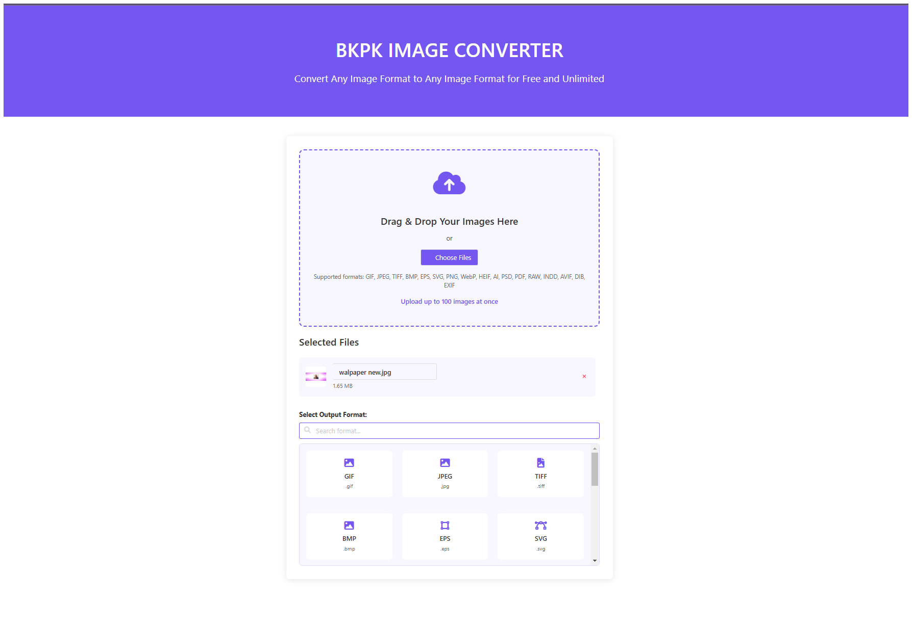

# BKPK IMAGE CONVERTER



## 🔥 Convert Any Image Format to Any Format for Free & Unlimited!

**BKPK Image Converter** is a powerful online tool that allows users to convert images between multiple formats quickly and easily. It supports a wide range of image formats, ensuring seamless conversion.

## 🚀 Features

- **Supports multiple formats**: GIF, JPEG, TIFF, BMP, EPS, SVG, PNG, WebP, HEIF, AI, PSD, PDF, RAW, INDD, AVIF, DIB, and more.
- **Drag and Drop & File Upload**: Easily add images for conversion.
- **Batch Processing**: Convert up to **100 images at once**.
- **No Limits**: Unlimited conversions for free.
- **Fast & Secure**: Ensures privacy by deleting uploaded files after processing.
- **User-Friendly UI**: Built with **Bulma CSS** for a sleek design.
- **Zip Download**: Download multiple converted images as a single ZIP file.

## 🛠️ Installation (For Developers)

To set up the tool locally, follow these steps:

1. Clone the repository:
   ```sh
   git clone https://github.com/bantikumarsatlokashram/imageConverter.git
   ```
2. Navigate to the project directory:
   ```sh
   cd imageConverter
   ```
3. Open `index.html` in a browser.

## 📖 Usage

1. Drag and drop images or use the file picker.
2. Select the desired output format from the dropdown.
3. Click **"Convert to [Format]"**.
4. Monitor the conversion progress.
5. Download converted files individually or as a ZIP archive.

## 📷 Supported Image Formats

- **Raster Images**: PNG, JPEG, GIF, BMP, WebP, TIFF, AVIF, DIB
- **Vector Formats**: SVG, EPS, AI
- **Document Formats**: PDF, INDD, PSD
- **RAW Formats**: RAW, HEIF, EXIF

## 🎨 Theme & Design
- **Primary Color**: `#7456f1`
- **Responsive & Mobile-Friendly**
- **Bulma CSS for styling**

## 🤝 Contribution

We welcome contributions! To contribute:
1. Fork the repository.
2. Create a feature branch (`git checkout -b feature-name`).
3. Commit changes (`git commit -m "Added a new feature"`).
4. Push to the branch (`git push origin feature-name`).
5. Create a Pull Request.

## 📄 License

This project is available under the **Apache License**.

---

### 🌟 Connect with Us
For feedback, suggestions, or bug reports, reach out via:
- 🌍 Website: [BKPK Video](https://www.bkpkvideo.com)
- 📧 Email: support@bkpkvideo.com
- 🐦 Twitter: [@BKPKVIDEO](https://twitter.com/BKPKVIDEO)

Enjoy Converting! 🚀
